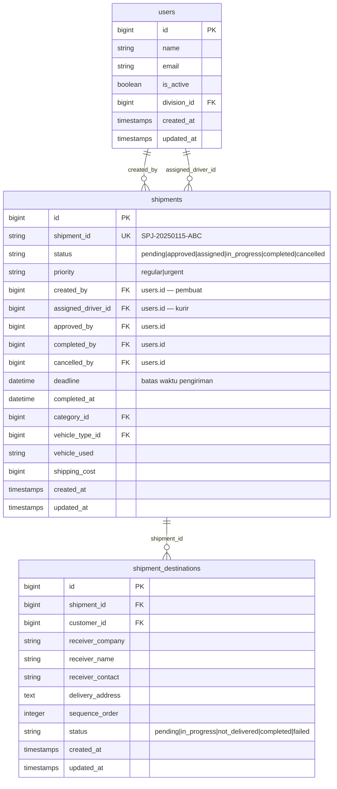
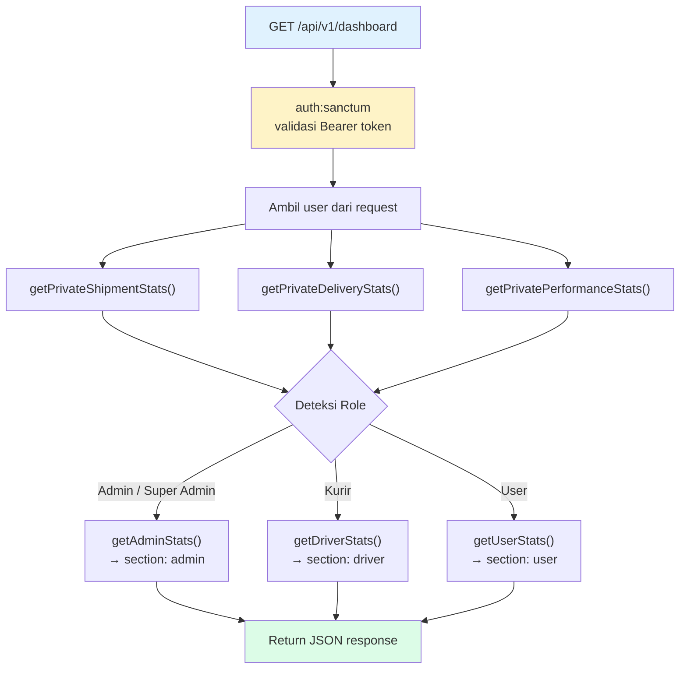
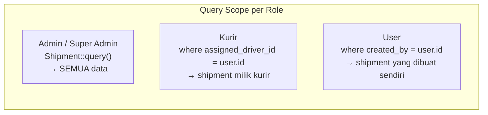

# Dashboard Endpoint — Skema & Diagram

## A. ERD — Tabel yang Terlibat

---

## B. Flowchart — Alur Response per Role

---

## C. Role-Based Query Filter

---

## D. Field Mapping — Dari Mana Setiap Nilai Berasal

### Section: `shipments`

| Field | Kolom DB | Query |
|-------|----------|-------|
| `total` | `shipments.*` | `COUNT(*)` semua shipment (sesuai role) |
| `today` | `shipments.created_at` | `COUNT(*) WHERE created_at = TODAY` |
| `pending` | `shipments.status` | `COUNT(*) WHERE status = 'pending'` |
| `approved` | `shipments.status` | `COUNT(*) WHERE status = 'approved'` |
| `assigned` | `shipments.status` | `COUNT(*) WHERE status = 'assigned'` |
| `in_progress` | `shipments.status` | `COUNT(*) WHERE status = 'in_progress'` |
| `completed` | `shipments.status` | `COUNT(*) WHERE status = 'completed'` |
| `cancelled` | `shipments.status` | `COUNT(*) WHERE status = 'cancelled'` |
| `urgent` | `shipments.priority` | `COUNT(*) WHERE priority = 'urgent'` |

### Section: `deliveries`

> Hanya menghitung shipment yang sudah **completed**, berdasarkan `updated_at`.

| Field | Periode | Query |
|-------|---------|-------|
| `today` | Hari ini | `WHERE status = 'completed' AND updated_at >= startOfDay` |
| `this_week` | Minggu ini (Senin) | `WHERE status = 'completed' AND updated_at >= startOfWeek` |
| `this_month` | Bulan ini | `WHERE status = 'completed' AND updated_at >= startOfMonth` |

### Section: `performance`

> Scope: **bulan berjalan saja** (`updated_at >= startOfMonth`).

| Field | Formula | Penjelasan |
|-------|---------|------------|
| `completion_rate` | `(completed / total) * 100` | `total` = semua shipment bulan ini, `completed` = yang berstatus completed |
| `on_time_rate` | `(onTime / completed) * 100` | `onTime` = completed yang `updated_at <= deadline`. Return 0 jika tidak ada completed |

### Section: `driver` (khusus role Kurir)

| Field | Kolom DB | Query |
|-------|----------|-------|
| `assigned_today` | `shipments.created_at` | `WHERE assigned_driver_id = user.id AND created_at = TODAY` |
| `in_progress` | `shipments.status` | `WHERE assigned_driver_id = user.id AND status = 'in_progress'` |
| `completed_today` | `shipments.updated_at` | `WHERE assigned_driver_id = user.id AND status = 'completed' AND updated_at = TODAY` |
| `pending_destinations` | `shipment_destinations.status` | `JOIN shipments → WHERE driver_id = user.id AND destination.status = 'pending'` |

### Section: `admin` (khusus role Admin)

| Field | Kolom DB | Query |
|-------|----------|-------|
| `pending_approvals` | `shipments.status` | `WHERE status = 'pending'` |
| `unassigned_shipments` | `shipments.assigned_driver_id` | `WHERE status = 'approved' AND assigned_driver_id IS NULL` |
| `active_drivers` | `users.is_active` | `WHERE role = 'Kurir' AND is_active = true` |
| `standby_drivers` | `shipments.status` | Kurir aktif yang TIDAK punya shipment `assigned`/`in_progress` |
| `total_users` | `users.is_active` | `WHERE is_active = true` |
| `recent_shipments` | `shipments.*` | 5 terbaru, `ORDER BY created_at DESC LIMIT 5` |

### Section: `user` (khusus role User/Requester)

| Field | Kolom DB | Query |
|-------|----------|-------|
| `my_shipments` | `shipments.created_by` | `WHERE created_by = user.id` |
| `pending_approval` | `shipments.status` | `WHERE created_by = user.id AND status = 'pending'` |
| `in_delivery` | `shipments.status` | `WHERE created_by = user.id AND status IN ('assigned', 'in_progress')` |
| `completed_this_month` | `shipments.created_at` | `WHERE created_by = user.id AND status = 'completed' AND created_at >= startOfMonth` |
